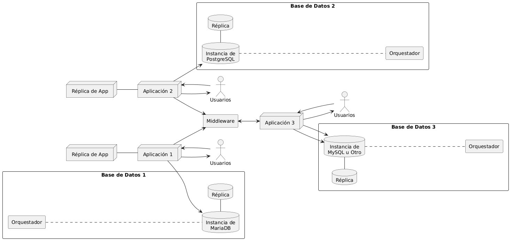

# Proyecto 3 - Sistemas Distribuidos

**Universidad de Talca**  
rpavez@utalca.cl  
23 de junio de 2026

---

## Enunciado

Una de las características de un sistema distribuido es mantener la transparencia hacia el usuario, tarea compleja de lograr ya que requiere una preocupación importante por la tolerancia a fallos. Con la idea de intentar lograr este propósito, pero en un ambiente acotado, se le pide establecer la configuración esencial para que distintos usuarios, de diversos niveles, puedan seguir operando a pesar de la ocurrencia de fallos en la comunicación o en la desconexión de algunas áreas.

A continuación, encontrará los requerimientos a abordar en el proyecto de la unidad 3, el que deberá ser resuelto en equipos de entre 4 a 6 integrantes.

---

## Requerimientos

Un centro de salud de referencia en la región requiere implantar una actualización en sus sistemas informáticos, pasando desde un trabajo en forma 100% local a un procesamiento distribuido en datos y cómputo.

Actualmente se mantienen varios sistemas de áreas específicas y uno de propósito general que permite agendar y mantener la ficha de los pacientes. Inicialmente se ha mantenido todo de forma local por seguridad y falta de equipamiento adecuado, ya que la manipulación de fichas clínicas es una alta responsabilidad, teniendo incluso que asegurar la permanencia de datos por a lo menos 5 años.

El listado de software "independiente" que utilizan es más o menos el siguiente:

- Contador y llamado de pacientes por ticket de atención.
- Sistema de almacenamiento de exámenes de laboratorio, es de alto cómputo ya que requiere un enlace directo con algunas de las máquinas del laboratorio.
- Sistema de remuneraciones.
- Intranet para empleados.
- Sistema de bodega e inventario.
- Sistema de flujo de pabellón.
- Sistema de planificación de pabellón.
- Sistema de fichas de atención de pacientes.

Hoy todos estos sistemas requieren una autenticación y no todo el personal puede ver todos los sistemas.

---

## Diagrama de Arquitectura Propuesta

La Figura 1 muestra una arquitectura distribuida de una aplicación con acceso a distintas bases de datos, buscando asegurar la accesibilidad y persistencia de datos.

---

## Interpretación de la Arquitectura

- **Aplicaciones 1, 2 y 3** tendrán funciones distintas, cada una con tipos de usuarios específicos y desarrolladas en lenguajes diferentes. Esto último al menos entre las aplicaciones 1 y 2.

- **Aplicaciones 1 y 2** deberán tener réplicas de datos y de aplicación. Estas no se comunicarán entre ellas, sino que la comunicación será entre aplicación 3 - 1 y 3 - 2.

- El **Middleware** tendrá un rol fundamental en la comunicación y transformación de datos, la que se dará a través del uso de API.

- La **Aplicación 1** tendrá un motor de base de datos en MariaDB, mientras que la **Aplicación 2** se comunicará a una base de datos en PostgreSQL. Ambas bases de datos tendrán sus propias réplicas y un orquestador para el monitoreo y gestión.

- La **Aplicación 3** solo tendrá réplica de datos.

- Las distintas aplicaciones podrán ser en ambiente web y/o escritorio.

---

## Se pide...

Establecer una arquitectura que sea **"Tolerante a Fallos"**, manteniendo el contexto del proyecto de la Unidad 2, pero ajustado a la arquitectura y la forma de comunicación definidos en la sección anterior. Para este proyecto se requiere la incorporación de un módulo adicional, que represente alguno de los sistemas que forman parte del ecosistema del centro médico. Un elemento muy importante a representar es la distribución de la base de datos, la que podría estar fragmentada entre distintos servidores.

Como parte de su entrega se deberá elaborar una propuesta de **SLA** y **SLO**, documentos que complementarán el diseño de su arquitectura.

La solución desarrollada deberá cumplir con las diversas pruebas que se describen a continuación.

---

## Pruebas

Con la idea de validar las distintas situaciones que puedan ocurrir, en relación a la **"Tolerancia de Fallos"**, se deberán hacer pruebas como las que se mencionan a continuación:

1. **Pérdida de conectividad con los servidores principales de aplicación.**  
   En este caso se espera que exista un registro que informe la situación, al menos de forma interna (log) y que se mantenga el funcionamiento a través del servidor de réplica de la aplicación. Es posible que se defina un funcionamiento acotado para las réplicas de aplicación, dejando operativa algunas de las acciones principales.

2. **Interrupción del servicio de base de datos.**  
   Lo que permitirá a los distintos orquestadores realizar el cambio hacia la réplica de datos, verificando que se cumpla la integridad y consistencia de datos.

3. **Simulación de una caída del Middleware.**

Es posible agregar otros escenarios de prueba si lo estiman conveniente. El resultado de las distintas pruebas deberá ser documentado en el informe del proyecto.

---

## Entregas

El desarrollo de este proyecto se compone de dos entregas.