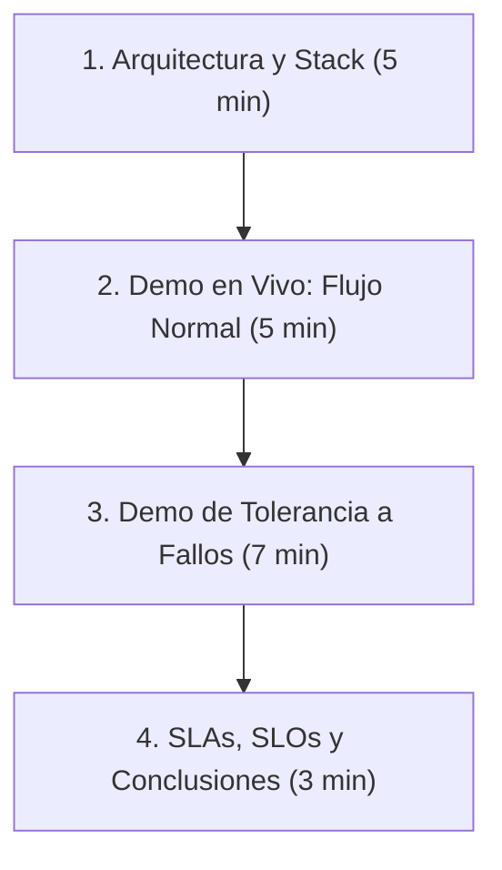

# Guía de Presentación - Proyecto 3 (Sistemas Distribuidos)

Esta guía detalla la estructura y el paso a paso recomendado para la presentación de 20 minutos de la **Entrega Final (Unidad 3)** del proyecto del Centro de Salud Digital. Está diseñada para demostrar dominio técnico de la solución y certificar el cumplimiento de todos los requisitos frente al profesor.

---

## 📋 Estructura de la Presentación



---

## 1. Arquitectura y Stack Tecnológico (5 minutos)

### Conceptos clave a exponer:
* **Infraestructura Híbrida Multi-VM en GCP:** Tres Máquinas Virtuales en la zona `us-central1-a` de GCP dentro de una VPC privada:
  * **[VM 1 (Hospital Local)](file:///c:/Users/Administrator/Desktop/Proyecto-OSDS/vms/vm1-hospital/docker-compose.yml) (10.128.0.10):** Corre la aplicación clínica de Estaciones Médicas y su motor MariaDB. Permite la operación local autónoma del hospital.
  * **[VM 2 (Nube Central)](file:///c:/Users/Administrator/Desktop/Proyecto-OSDS/vms/vm2-nube/docker-compose.yml) (10.128.0.20):** Aloja el sistema administrativo de admisiones y PostgreSQL core central.
  * **[VM 3 (Gateway & Middleware)](file:///c:/Users/Administrator/Desktop/Proyecto-OSDS/vms/vm3-gateway/docker-compose.yml) (10.128.0.30):** Proxy Nginx, Cloudflare Tunnel, App de Bodega, Middleware y base de datos central de auditoría.
* **Heterogeneidad Tecnológica:**
  * **App 1 (Estaciones Médicas):** Escrita en **Node.js** con WebSockets (Socket.io) y MariaDB.
  * **App 2 (Terminales Administrativas):** Escrita en **Python 3.10** (aiohttp + asyncpg) y PostgreSQL.
  * **App 3 (Sistema de Bodega):** API REST en **Node.js/Express** y base MySQL.
* **Distribución de Capa de Datos:** Explicar cómo los orquestadores (**HAProxy**) gestionan y monitorean la replicación de datos en caliente para MariaDB y PostgreSQL.

---

## 2. Demo en Vivo: Flujo Normal y SecOps (5 minutos)

### Paso a paso de la simulación:
1. **Acceso Seguro (SecOps):** Ingrese a la URL pública **[https://osds.epistia.cl](https://osds.epistia.cl)**. Resalte al profesor que todos los puertos entrantes en el Firewall de GCP para la VM3 están cerrados. La conexión se realiza a través de un túnel seguro **Cloudflare Tunnel (`cloudflared`)**.
2. **Ingreso y RBAC:**
   * Inicie sesión en la página como **Administrativo** y registre un nuevo paciente (ej: *RUT: 77777777-7, Clara Campo*). Explique que esta transacción viaja síncronamente hacia PostgreSQL (VM 2).
   * Inicie sesión como **Médico** e ingrese el RUT `77777777-7`. La ficha cargará de inmediato en el panel clínico. Explique que los datos se sincronizaron en el backend de forma asíncrona hacia la base MariaDB (VM 1).
3. **Módulo de Bodega Integrado:**
   * Muestre la tabla de **Inventario de Bodega** recién incorporada en la parte inferior del frontend.
   * Modifique el diagnóstico de la ficha clínica del paciente y recete **"Paracetamol 500mg"**. Al guardar los cambios, muestre cómo el stock de la bodega se actualiza en tiempo real de forma síncrona en el frontend.

---

## 3. Demo en Vivo: Tolerancia a Fallos (7 minutos)

*Este es el núcleo de la evaluación. Se demuestra deteniendo contenedores Docker mediante SSH en vivo.*

### Escenario 1: Caída de Servidor de Aplicación (VM 2)
* **Comando para forzar el fallo:**
  ```bash
  gcloud compute ssh vm-nube-central --zone=us-central1-a --command="sudo docker stop app-terminales" --quiet
  ```
* **Qué demostrar:** Intente admitir a otro paciente en el frontend. La operación completará exitosamente.
* **Explicación:** Nginx en la VM3 detecta la caída y realiza una conmutación (*failover*) transparente enviando el tráfico de WebSocket hacia `app-terminales-replica` en menos de 5 segundos. Muestre los logs de Nginx en la terminal:
  ```bash
  gcloud compute ssh vm-gateway --zone=us-central1-a --command="sudo docker logs nginx-proxy --tail 20" --quiet
  ```

### Escenario 2: Interrupción del Servicio de Base de Datos Local (VM 1)
* **Comando para forzar el fallo:**
  ```bash
  gcloud compute ssh vm-hospital-local --zone=us-central1-a --command="sudo docker stop db-local-master" --quiet
  ```
* **Qué demostrar:** Consulte nuevamente el RUT de un paciente en el frontend. La ficha clínica cargará con normalidad.
* **Explicación:** El balanceador TCP **HAProxy** de la VM 1 redirige automáticamente las peticiones SQL hacia la base de datos de réplica `db-local-replica`. Muestre los logs de HAProxy confirmando la conmutación:
  ```bash
  gcloud compute ssh vm-hospital-local --zone=us-central1-a --command="sudo docker logs db-local-proxy --tail 15" --quiet
  ```

### Escenario 3: Caída del Módulo de Bodega (VM 3)
* **Comando para forzar el fallo:**
  ```bash
  gcloud compute ssh vm-gateway --zone=us-central1-a --command="sudo docker stop app-bodega" --quiet
  ```
* **Qué demostrar:** Ingrese un diagnóstico recetando *"Paracetamol"*. El sistema guardará el diagnóstico sin errores en el frontend.
* **Explicación:** 
  * Señale el indicador **"Cola de Contingencia"** en la parte superior derecha de la pantalla: cambiará a naranja con valor **`1`** (o superior).
  * Explique que el [Middleware](file:///c:/Users/Administrator/Desktop/Proyecto-OSDS/apps/middleware/server.js) resguardó la transacción en SQLite de contingencia para evitar pérdida de datos.
  * Levante el servicio de bodega:
    ```bash
    gcloud compute ssh vm-gateway --zone=us-central1-a --command="sudo docker start app-bodega" --quiet
    ```
  * Muestre cómo el indicador del frontend vuelve automáticamente a **`0`** (Verde) y el stock de la bodega se descuenta de forma asíncrona tras unos segundos.

---

## 4. SLA, SLO y Conclusiones (3 minutos)

### SLA (Acuerdos de Nivel de Servicio):
* **Disponibilidad Comprometida:** 99.5% para aplicaciones críticas y 99.9% para bases de datos consolidadas.
* **RTO (Objetivo de Tiempo de Recuperación):** < 5 segundos para failover de aplicación y < 3 segundos para base de datos.
* **RPO (Objetivo de Punto de Recuperación):** 0 segundos de pérdida de datos en transacciones clínicas.

### Conclusiones Principales:
1. **Transparencia hacia el usuario:** Ante fallas de servidores de aplicaciones, bases de datos o servicios adicionales (Bodega), el usuario nunca sufre desconexión ni pérdida de información.
2. **Resiliencia distribuida:** La combinación de réplicas en caliente (orquestadas por HAProxy y Nginx) y colas de contingencia locales (SQLite) garantiza la consistencia eventual y la continuidad operativa.
