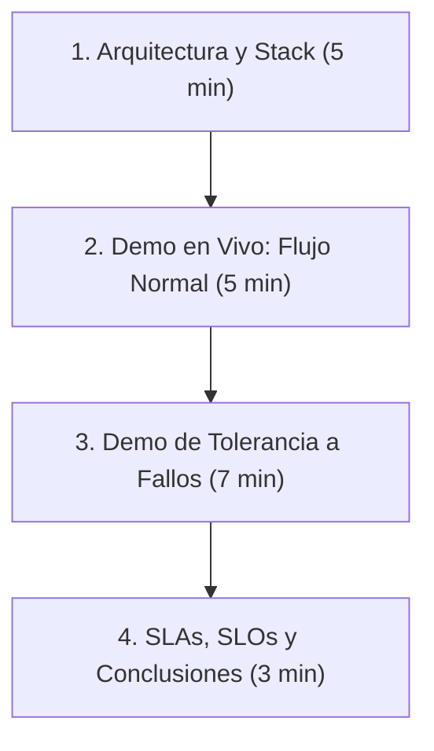

# Guía de Presentación - Proyecto 3 (Sistemas Distribuidos)

Esta guía detalla la estructura, el guion técnico y el paso a paso recomendado para la presentación de 20 minutos de la **Entrega Final (Unidad 3)** del proyecto del Centro de Salud Digital. Está diseñada para demostrar dominio técnico de la solución y certificar el cumplimiento de todos los requisitos del sistema distribuido frente a la comisión evaluadora.

---

## 📋 Estructura de la Presentación



---

## 1. Arquitectura y Stack Tecnológico (5 minutos)

### Conceptos clave a exponer:
*   **Infraestructura Distribuidora Multi-VM en GCP:** Tres Máquinas Virtuales en la zona `us-central1-a` de GCP dentro de una VPC privada:
    *   **[VM 1 (Hospital Local)](file:///c:/Users/Administrator/Desktop/Proyecto-OSDS/vms/vm1-hospital/docker-compose.yml) (10.128.0.10):** Corre la aplicación clínica de Estaciones Médicas y su motor de base de datos PostgreSQL local en Alta Disponibilidad (Maestro-Réplica + HAProxy). Permite la operación local autónoma del hospital.
    *   **[VM 2 (Nube Central)](file:///c:/Users/Administrator/Desktop/Proyecto-OSDS/vms/vm2-nube/docker-compose.yml) (10.128.0.20):** Aloja el sistema administrativo de admisiones y la base de datos PostgreSQL en la nube (Maestro-Réplica + HAProxy).
    *   **[VM 3 (Gateway & Central Services)](file:///c:/Users/Administrator/Desktop/Proyecto-OSDS/vms/vm3-gateway/docker-compose.yml) (10.128.0.30):** Proxy Nginx, Cloudflare Tunnel, App de Bodega, Middleware, base de datos central de auditoría y base de contingencia.
*   **Heterogeneidad Tecnológica Real (Integración de Sistemas Heredados):**
    *   **App 1 (Estaciones Médicas):** Escrita en **Node.js** con WebSockets (`socket.io`) y base de datos PostgreSQL 16 local.
    *   **App 2 (Terminales Administrativas):** Escrita en **Python 3.10** asíncrono (`aiohttp` + `asyncpg`) y base de datos PostgreSQL 16 en la nube.
    *   **App 3 (Sistema de Bodega):** API REST en **Node.js/Express** conectada a la base de datos central.
    *   **Middleware:** Microservicio en **Node.js/Express** encargado del enrutamiento de transacciones, análisis de texto e inventario.
*   **Distribución y Replicación de la Capa de Datos:**
    *   **Replicación Física (Maestro-Réplica):** Configurada en los 3 nodos usando streaming de WALs (`pg_basebackup`) administrados mediante balanceadores TCP (**HAProxy**) para failover automático de base de datos.
    *   **Replicación Lógica Bidireccional:** Configurada entre `db-local` (VM1) y `db-nube` (VM2) para sincronizar en tiempo real la tabla `fichas_pacientes` según su procedencia (`origen_registro`).

---

## 2. Demo en Vivo: Flujo Normal y SecOps (5 minutos)

### Paso a paso de la simulación:
1.  **Acceso Seguro (SecOps):** Ingrese a la URL pública **[https://osds.epistia.cl](https://osds.epistia.cl)**. Explique a la comisión que las VMs no tienen puertos públicos abiertos al exterior en GCP. Toda la comunicación externa está encriptada y se realiza exclusivamente a través de **Cloudflare Tunnel (`cloudflared`)** conectado al proxy **Nginx** en la VM3.
2.  **Admisión de Paciente (Rol Administrativo):**
    *   Inicie sesión en la interfaz web como **Administrativo**.
    *   Registre un nuevo paciente (ej: *RUT: 77777777-7, Clara Campo, diagnóstico: Admisión general*).
    *   Explique que esta petición viaja a través de WebSockets síncronos hacia la base de datos central consolidada en la Nube (VM 2).
3.  **Consulta Médica (Rol Médico):**
    *   Inicie sesión como **Médico** en la interfaz web.
    *   Busque al paciente recién ingresado usando el RUT `77777777-7`. La ficha clínica se visualizará inmediatamente.
    *   Explique que los datos se replicaron automáticamente y en tiempo real desde la Nube (VM2) hacia el Hospital Local (VM1) mediante replicación lógica bidireccional de PostgreSQL.
4.  **Consumo e Inventario de Bodega Integrado:**
    *   Muestre la tabla de **Inventario de Bodega** en la sección inferior del frontend.
    *   Modifique el diagnóstico del paciente agregando la receta del medicamento controlado: **"Paracetamol 500mg"** (o *"Ibuprofeno 600mg"*).
    *   Al guardar los cambios, muestre cómo el stock de la bodega se descuenta de forma síncrona en el frontend de 498 a 497 unidades.
    *   Explique el flujo: El Middleware interceptó la palabra clave, extrajo el código `INS-001` y notificó al servicio de Bodega (`app-bodega`) para actualizar el stock.
5.  **Verificación Rápida de Replicación Física (Maestro-Réplica en VM3):**
    *   Para certificar en vivo ante la comisión la replicación física en streaming de base de datos:
        *   **Verificar insumo en la Réplica (Existe):**
            ```bash
            gcloud compute ssh vm-gateway --zone=us-central1-a --command="sudo docker exec -t db-central-replica psql -U postgres -d clinica_central -c \"SELECT codigo, nombre FROM inventario_insumos WHERE codigo = 'INS-001';\"" --quiet
            ```
        *   **Eliminar insumo en el Maestro:**
            ```bash
            gcloud compute ssh vm-gateway --zone=us-central1-a --command="sudo docker exec -t db-central-master psql -U postgres -d clinica_central -c \"DELETE FROM inventario_insumos WHERE codigo = 'INS-001';\"" --quiet
            ```
        *   **Confirmar eliminación instantánea en la Réplica (No existe):**
            ```bash
            gcloud compute ssh vm-gateway --zone=us-central1-a --command="sudo docker exec -t db-central-replica psql -U postgres -d clinica_central -c \"SELECT codigo, nombre FROM inventario_insumos WHERE codigo = 'INS-001';\"" --quiet
            ```
        *   **Restaurar el insumo original en el Maestro:**
            ```bash
            gcloud compute ssh vm-gateway --zone=us-central1-a --command="sudo docker exec -t db-central-master psql -U postgres -d clinica_central -c \"INSERT INTO inventario_insumos (codigo, nombre, stock, descripcion) VALUES ('INS-001', 'Paracetamol 500mg', 500, 'Analgesico y antipiretico comun');\"" --quiet
            ```

---

## 3. Demo en Vivo: Tolerancia a Fallos y Alta Disponibilidad (7 minutos)

*Este es el núcleo de la evaluación. Se demuestra deteniendo contenedores Docker mediante SSH en vivo.*

### Escenario 1: Caída de Servidor de Aplicación (VM 2)
*   **Comando para forzar el fallo (en Cloud Shell):**
    ```bash
    gcloud compute ssh vm-nube-central --zone=us-central1-a --command="sudo docker stop app-terminales" --quiet
    ```
*   **Qué demostrar:** Intente admitir a otro paciente en el frontend. La operación completará exitosamente sin interrupción de servicio.
*   **Explicación:** Nginx en la VM3 detecta la caída del nodo principal y conmuta (*failover*) el tráfico de WebSockets hacia `app-terminales-replica` de forma transparente en menos de 5 segundos. Muestre los logs de Nginx en Cloud Shell para probar el desvío:
    ```bash
    gcloud compute ssh vm-gateway --zone=us-central1-a --command="sudo docker logs nginx-proxy --tail 20" --quiet
    ```
*   **Comando para restaurar el servicio (volver a la normalidad):**
    ```bash
    gcloud compute ssh vm-nube-central --zone=us-central1-a --command="sudo docker start app-terminales" --quiet
    ```

### Escenario 2: Interrupción del Servicio de Base de Datos Local (VM 1)
*   **Comando para forzar el fallo (en Cloud Shell):**
    ```bash
    gcloud compute ssh vm-hospital-local --zone=us-central1-a --command="sudo docker stop db-local-master" --quiet
    ```
*   **Qué demostrar:** Consulte nuevamente el RUT de un paciente en el frontend. La ficha clínica cargará normalmente.
*   **Explicación:** Las aplicaciones apuntan al puerto `5432` expuesto por **HAProxy**. Al caerse la base de datos maestra (`db-local-master`), HAProxy redirige automáticamente todas las consultas a la base de datos réplica de lectura `db-local-replica` en menos de 3 segundos. Muestre los logs de HAProxy confirmando la conmutación:
    ```bash
    gcloud compute ssh vm-hospital-local --zone=us-central1-a --command="sudo docker logs db-local-proxy --tail 15" --quiet
    ```
*   **Comando para restaurar el servicio (volver a la normalidad):**
    ```bash
    gcloud compute ssh vm-hospital-local --zone=us-central1-a --command="sudo docker start db-local-master" --quiet
    ```

### Escenario 3: Caída del Módulo de Bodega / Central (VM 3)
*   **Comando para forzar el fallo (en Cloud Shell):**
    ```bash
    gcloud compute ssh vm-gateway --zone=us-central1-a --command="sudo docker stop app-bodega" --quiet
    ```
*   **Qué demostrar:** Ingrese a la ficha de un paciente e ingrese un diagnóstico recetando *"Paracetamol"*. El sistema guardará el diagnóstico sin errores y la interfaz web continuará respondiendo de forma normal.
*   **Explicación:**
    *   Muestre el indicador **"Cola de Contingencia"** en la parte superior derecha de la pantalla: cambiará a color naranja mostrando un número mayor a `0` (acumula los mensajes diferidos).
    *   Explique que el Middleware resguardó la transacción en la base de datos de contingencia de PostgreSQL (`db-contingencia`) para evitar pérdida de datos clínicos.
*   **Comando para restaurar el servicio (volver a la normalidad):**
    ```bash
    gcloud compute ssh vm-gateway --zone=us-central1-a --command="sudo docker start app-bodega" --quiet
    ```
*   **Qué demostrar después de restaurar:** Muestre cómo el indicador del frontend vuelve automáticamente a **`0`** (Verde) y el stock de la bodega se actualiza de forma asíncrona tras unos segundos mediante el worker sincronizador.

---

## 4. SLA, SLO y Conclusiones (3 minutos)

### SLA (Acuerdos de Nivel de Servicio):
*   **Disponibilidad Comprometida (SLA):** 99.5% para aplicaciones críticas y 99.9% para bases de datos consolidadas.
*   **RTO (Objetivo de Tiempo de Recuperación):** < 5 segundos para failover de aplicación y < 3 segundos para base de datos.
*   **RPO (Objetivo de Punto de Recuperación):** 0 segundos de pérdida de datos en transacciones clínicas.

### Conclusiones Principales:
1.  **Transparencia hacia el usuario:** Ante fallas de servidores de aplicaciones, bases de datos o servicios de inventario, el usuario final nunca sufre caídas de sesión ni pérdida de información.
2.  **Resiliencia distribuida:** La combinación de réplicas en caliente (orquestadas por HAProxy y Nginx) y colas de contingencia locales (PostgreSQL) garantiza la consistencia eventual y la continuidad operativa del sistema.
