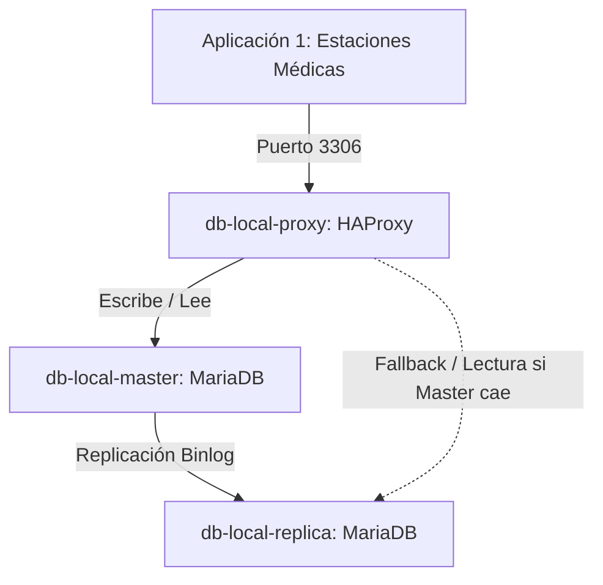

# Plan de Implementación - Punto 1: Migración a MariaDB en Hospital Local (VM1)

Este plan detalla los pasos para migrar la base de datos del **Hospital Local (VM1)** desde PostgreSQL a una arquitectura tolerante a fallos basada en **MariaDB (Maestro-Réplica)**, con un balanceador/orquestador **HAProxy** para enrutar el tráfico de base de datos.

---

## 🏗️ Nueva Arquitectura de Base de Datos para VM1

Reemplazaremos la instancia única de PostgreSQL por tres contenedores interconectados dentro de la red `hospital_net` de la VM1:

1. **`db-local-master` (MariaDB Primario):** Procesa escrituras y lecturas principales.
2. **`db-local-replica` (MariaDB Réplica):** Sigue al maestro de forma asíncrona mediante replicación clásica por log binario.
3. **`db-local-proxy` (HAProxy / Orquestador de Failover):** Expone el puerto `3306` hacia la aplicación. Monitorea la salud del maestro; si este cae, redirige las peticiones a la réplica para mantener la continuidad operacional.

---

## 🛠️ Cambios Propuestos por Componente

### 1. [MODIFY] [docker-compose.yml](file:///home/maruzs/Desktop/Uni/OSDS/Proyecto-OSDS/vms/vm1-hospital/docker-compose.yml)
*   Eliminar el servicio `db-local` basado en PostgreSQL.
*   Agregar `db-local-master` (MariaDB) montando un volumen y el script de inicialización.
*   Agregar `db-local-replica` (MariaDB) configurado para conectarse al maestro.
*   Agregar `db-local-proxy` (HAProxy) con reglas de balanceo y detección de fallos.
*   Actualizar las variables de entorno de la aplicación `app-estaciones` para conectarse a `db-local-proxy:3306` con la librería de MariaDB/MySQL.

### 2. [NEW] [haproxy.cfg](file:///home/maruzs/Desktop/Uni/OSDS/Proyecto-OSDS/vms/vm1-hospital/config/proxy/haproxy.cfg)
*   Configurar HAProxy para escuchar en el puerto `3306`.
*   Definir health checks tcp/mysql para `db-local-master` (principal) y `db-local-replica` (backup).

### 3. [NEW] [init-local.sql](file:///home/maruzs/Desktop/Uni/OSDS/Proyecto-OSDS/vms/vm1-hospital/config/db/init-local.sql)
*   Reescribir la creación de la tabla `fichas_pacientes` adaptando tipos de datos a MariaDB:
    *   Cambiar `UUID` a `VARCHAR(36)`.
    *   Cambiar sintaxis de inserción de pruebas (`ON CONFLICT` a `ON DUPLICATE KEY UPDATE`).
    *   Definir un usuario de replicación (`repl`) y permisos correspondientes.

### 4. [MODIFY] [server.js](file:///home/maruzs/Desktop/Uni/OSDS/Proyecto-OSDS/vms/vm1-hospital/apps/estaciones-medicas/server.js)
*   Cambiar la dependencia `pg` por **`mysql2/promise`**.
*   **Adaptación de SQL y Sintaxis de Consultas:**
    *   MariaDB no soporta `RETURNING *` en sentencias `UPDATE`. Modificaremos el evento `actualizar_diagnostico` para que primero realice el `UPDATE` y luego haga un `SELECT` para retornar la ficha actualizada.
    *   Cambiar marcadores de parámetros de Postgres (`$1, $2`) a MariaDB (`?, ?`).
*   Actualizar la configuración del pool de conexiones.

### 5. [MODIFY] [package.json](file:///home/maruzs/Desktop/Uni/OSDS/Proyecto-OSDS/vms/vm1-hospital/apps/estaciones-medicas/package.json)
*   Desinstalar `pg`.
*   Agregar `mysql2` como dependencia.

---

## 🧪 Plan de Verificación y Pruebas

### Paso 1: Pruebas Locales (Docker local)
1. Iniciar los contenedores en local: `docker compose up --build -d`.
2. Verificar replicación:
   * Insertar un registro de prueba en `db-local-master`.
   * Conectarse a `db-local-replica` y comprobar que el registro se replicó.
3. Verificar funcionamiento de la App:
   * Conectarse al cliente WebSocket y realizar consultas y actualizaciones de diagnósticos.

### Paso 2: Prueba de Tolerancia a Fallos de Base de Datos
1. Detener el contenedor del maestro: `docker stop db-local-master`.
2. Verificar en los logs de `db-local-proxy` que detectó la caída del master.
3. Realizar una consulta desde la Estación Médica. HAProxy debe redirigir la consulta al nodo `db-local-replica` permitiendo la lectura de la ficha clínica (modo degradado/lectura en fallo).
